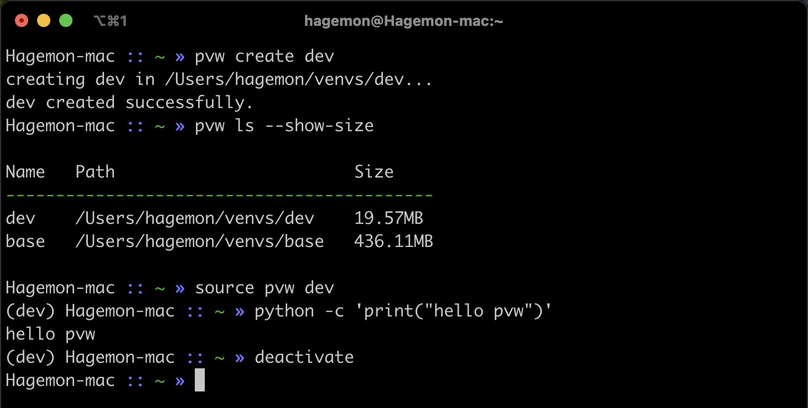

# pvw

A lightweight (~10kB) python venv wrapper for virtual environment management.

Based on the built-in venv since python 3.6.



## Pre-requirement

- Python >= 3.6
- python-venv

## Installation

```
pip install pvw
```
## Usage

```
usage: pvw [-h] [-v] {ls,config,activate,create,rm,mv,cp} ...

Manage python venv environments.

positional arguments:
  {ls,config,activate,create,rm,mv,cp}
    ls                  list all venvs.
    config              get or set pvw config
    activate            activate venv.
                        For Linux/Mac:
                        Use `source pvw activate ENV_NAME` to activate venv
                        or simply use `source pvw ENV_NAME`.

                        For Windows:
                        use `pvw activate ENV_NAME`
                        or a shorter `pvw ENV_NAME`
    create              create a new venv.
    rm                  remove a venv.
    mv                  move(rename) venv to another place.
    cp                  copy venv.

optional arguments:
  -h, --help            show this help message and exit
  -v, --version         show program's version number and exit

```

#### List venvs

```
pvw ls [--show-size]
```

List all created venvs, including name, path. 

Adding `--show-size` modifier will show sizes, which may take a few seconds.

```
Name   Path                  Size
--------------------------------------
env1   C:\Users\venvs\env1   199.42MB
env2   C:\Users\venvs\env2   21.83MB
st     C:\Users\venvs\st     313.99MB
v2     C:\Users\venvs\v2     21.86MB
v3     C:\Users\venvs\v3     21.85MB
```

#### Get or set configs

Get or set the directory `venv_path` where venvs are stored.

```bash
pvw config get venv_path # get venv_path variable
pvw config set venv_path=PATH/TO/VENV # set venv_path
```

#### Create venv

```
pvw create ENV_NAME
```

#### Activate venv

For **Windows**, activate an existing venv with:

```
pvw activate ENV_NAME
```

or a shorter command:

```
pvw ENV_NAME
```


For **Linux/Mac**, activate venv with `source` command:

```
source pvw activate ENV_NAME
```

or for short:

```
source pvw ENV_NAME
```

**Note**: Shorter command only works on non-keywords venv names.

To deactivate, use `deactivate` inside environment. E.g. in Windows

```
(ENV_NAME) PS D:\Users> deactivate
PS D:\Users> 
```


#### Remove venv

```
pvw rm ENV_NAME
```

Removal needs to be confirmed.

#### Move or rename venv

Move (or rename) `env1` to a venv `env2`, 

```
pvw mv env1 env2
```

Movement needs to be confirmed.

**Note**: the original venv would disappear.

#### Copy venv

Copy `env1` to a new venv `env2`

```
pvw cp env1 env2
```

## Build From Source

### Using Makefile

```bash
cd src/pvw
make
sudo make install
```
The executable binary `pvw` and `pvw_py` will be installed in your /usr/bin/ directory.

Note that `pyinstaller` and `termcolor` will also be installed.

### Using setuptools

```bash
pip install --upgrade build setuptools # skip if already installed
python -m build
pip install dist/pvw-x.x.x.tar.gz # x.x.x is the built version of pvw
```

## To-do list

- Customize venv path
- Simplify activate command in Linux/Mac OS
- Enable setting default venv in terminal
- Enable Editable installation (for dev)
- Add unit tests
- Support specific python version (if installed)